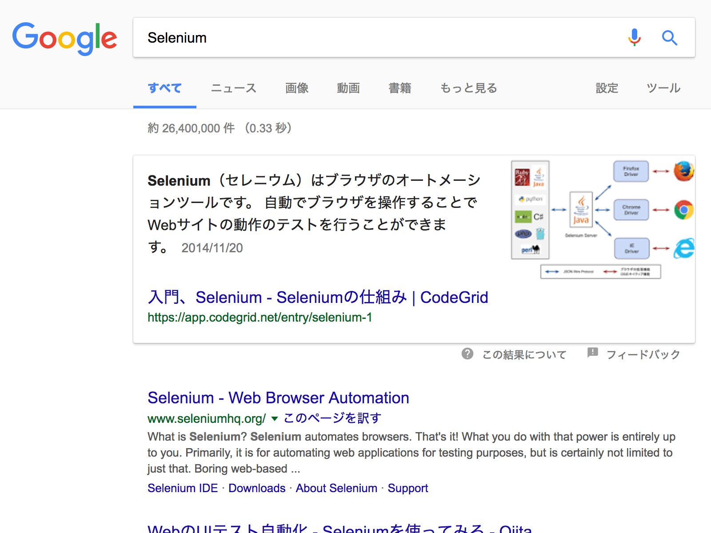

# Sample code using Headless chrome with Selenium,

## Main Dependencies
+ [Google Chrome 59]
+ [Selenium]
+ [Selene](https://github.com/yashaka/selene)
+ [python webdriver manager](https://github.com/SergeyPirogov/webdriver_manager)
+ [joblib](https://github.com/joblib/joblib)

## sample result

